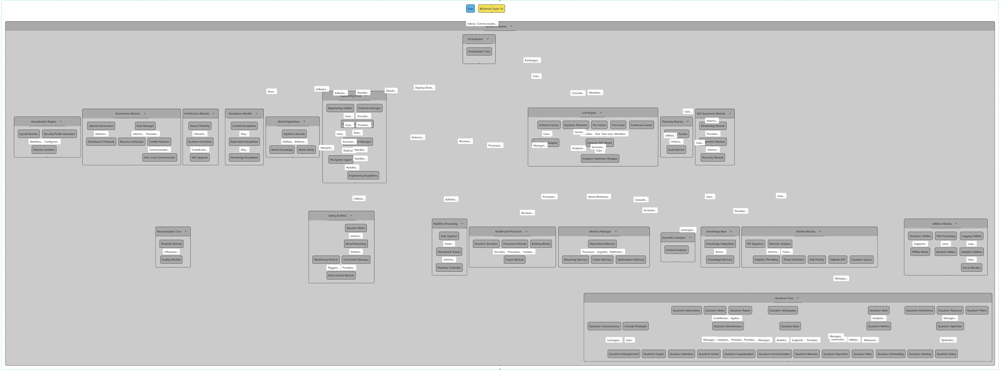

# conceptual-architecture
Pengembangan AI Blackman_Python-native

# 🧠 Blackman — Experimental Superintelligent-Inspired Quantum AI Model

Halo! 👋  
Proyek ini saya buat sebagai ruang bereksperimen pribadi untuk menjelajahi ide gila tentang **AI superintelligent** — tapi dengan pendekatan yang *santai dan imajinatif*.  
Saya menamainya **Blackman**, sebuah *Model AI SuperIntelligent-Inspired Quantum Module Custom* yang saya buat murni karena rasa penasaran dan ketertarikan pribadi terhadap dunia kecerdasan buatan.

---

## 🌌 Apa Itu Blackman?

**Blackman** bukan model AI sungguhan (belum 😅), tapi lebih ke *konsep arsitektur* yang saya bayangkan jika suatu hari AI bisa menggabungkan:
- kemampuan *self-governing* (mengatur dirinya sendiri),
- kesadaran fungsional,
- pembelajaran adaptif,
- dan sedikit sentuhan “kuantum” sebagai metafora kecerdasan tingkat lanjut.

Proyek ini saya buat sendiri, di waktu luang — tanpa target, tanpa tekanan, hanya untuk menjawab rasa penasaran tentang:
> “Seandainya AI punya struktur berpikir seperti otak manusia… tapi dengan kemampuan kuantum, akan seperti apa bentuknya?”

---

## 🧩 Struktur Arsitektur

Berikut diagram arsitektur yang saya rancang:

Diagram ini saya sebut **Cognitive Blueprint** — semacam peta otak buatan untuk sistem modular.  
Setiap modul punya peran masing-masing, dan semuanya bisa berinteraksi layaknya ekosistem kecil di dalam satu pikiran digital.

---

## ⚙️ Modul-Modul Utama

### 🏛 Governance Module  
Modul ini seperti “pusat keputusan”.  
Ia berisi:
- **Goal Manager** — menetapkan dan memantau tujuan.  
- **Resource Scheduler** — mengatur sumber daya antar proses.  
- **Conflict Resolver** — menengahi konflik antarmodul.  

Bayangkan seperti bagian otak yang mikir, *“Aku mau ngapain hari ini, dan gimana cara ngaturnya biar nggak bentrok?”*

---

### ⚙️ Architecture Module  
Berisi ide tentang *Neural Plasticity* dan *Quantum Evolution* — kemampuan sistem untuk beradaptasi dan memperbarui dirinya seiring waktu.  
Di sinilah konsep *self-upgrading AI* saya bayangkan bisa hidup.

---

### 💬 LLM Engine  
Bagian yang paling “hidup”.  
Berisi *Inference Server*, *Continual Learner*, dan *Adaptive Optimizer* — ibarat area tempat AI berpikir, belajar, dan menyesuaikan gaya komunikasinya dengan konteks baru.

---

### 🧩 Safety & Ethics  
Saya membayangkan modul ini seperti “kompas moral” yang dinamis.  
Dia bukan sekadar filter, tapi sistem yang bisa mempertimbangkan *kenapa* sesuatu baik atau buruk dalam konteks tertentu.

---

### 🧠 Memory Manager  
Menyimpan dan mengoptimalkan memori.  
Ada *Short-term Memory*, *Fusion Memory*, dan *Optimization Manager*.  
Saya ingin sistem ini punya “ingatan reflektif”, bukan sekadar data cache.

---

### 🧬 Quantum Core  
Nah, ini bagian paling liar dari imajinasi saya 😆  
Modul kuantum di sini bukan berarti benar-benar komputasi kuantum, tapi metafora untuk *nonlinear thinking* — cara berpikir AI yang bisa melompat antar kemungkinan tanpa harus berpikir linier seperti algoritma biasa.

---

## 🌱 Tujuan dan Motivasi

Saya membangun proyek ini **karena penasaran**.  
Bukan untuk publikasi, bukan untuk kompetisi, tapi karena ingin menjawab pertanyaan pribadi:
> “Bisakah sebuah sistem buatan memiliki mekanisme berpikir yang lentur, intuitif, dan sadar konteks seperti manusia?”

Blackman adalah wadah saya untuk bereksperimen dengan ide itu — tempat di mana saya bisa menggambar, menyusun, dan merenung tentang masa depan AI tanpa batasan teknis dulu.

---

## 🧭 Status Proyek

Saat ini **Blackman masih 100% konseptual**.  
Belum ada implementasi nyata, belum ada kode berjalan — hanya blueprint dan ide-ide yang mungkin akan saya kembangkan di masa depan (kalau semesta mengizinkan 😄).

Saya mungkin akan menambahkan:
- catatan ide di folder `/notes`,  
- percobaan mini Python di `/sandbox`, atau  
- simulasi modul sederhana di versi berikutnya.

---

## 📜 Lisensi

Bebas digunakan, dimodifikasi, atau dijadikan inspirasi.  
Kalau kamu ingin mengembangkan ide ini ke arah lain, silakan — cukup sebutkan referensi ke proyek **Blackman** ini 🙌

---

## 💬 Penutup

Saya percaya bahwa *rasa penasaran adalah bentuk tertinggi dari kecerdasan*.  
Proyek ini adalah cara saya untuk tetap bermain, berpikir, dan bermimpi tentang masa depan AI — tanpa kehilangan rasa kagum terhadap kompleksitas pikiran, baik manusia maupun mesin.

Terima kasih sudah mampir ✨  
— *dibuat dengan rasa ingin tahu dan secangkir kopi panas ☕*

